# AWS Serverless Event-Driven Microservices Architecture

  

## 📋 Project Overview
This repository demonstrates a fully **Serverless, Event-Driven Architecture** on AWS. It is designed to handle high-traffic bursts without managing a single server.

The application is an **Order Processing System** that decouples the user-facing API from heavy backend processing using **DynamoDB Streams**. This ensures the API remains fast and responsive even during peak load.

## 🏗 Architecture & Tech Stack

```mermaid
flowchart LR
    %% Nodes
    User([👤 User/Client])
    APIGW("AWS API Gateway\nHTTP API")
    L1["λ create_order\n(Python)"]
    DDB[("Amazon DynamoDB\nOrders Table")]
    L2["λ process_order\n(Python)"]
    CW(CloudWatch Logs)

    %% Flow Connections
    User -->|1. POST /orders JSON| APIGW
    APIGW -->|2. Invoke| L1
    L1 -->|3. PutItem Status: PENDING| DDB
    DDB -.->|4. Stream INSERT Event Async| L2
    L2 -->|5. Process & Log| CW

    %% Styling
    classDef aws fill:#FF9900,stroke:#232F3E,stroke-width:1px,color:white;
    classDef db fill:#3B48CC,stroke:#232F3E,stroke-width:1px,color:white;
    class L1,L2,APIGW aws;
    class DDB db;
```

* **Infrastructure as Code:** Terraform
* **API Layer:** AWS API Gateway (HTTP API)
* **Compute:** AWS Lambda (Python 3.9)
* **Database:** Amazon DynamoDB (On-Demand Capacity)
* **Event Bus:** DynamoDB Streams
* **Security:** IAM Roles with Least Privilege

## 🚀 Key Features
1.  **Infinite Scalability:** Automatically scales from 0 to 10,000 requests/second.
2.  **Event-Driven Decoupling:** The "Order Intake" function is separated from "Order Processing." If processing slows down, the user experience is not affected.
3.  **Pay-Per-Use:** Costs are exactly $0.00 when the system is idle.
4.  **Infrastructure as Code:** Entire stack is deployable via a single `terraform apply`.

## 🛠️ How it Works
1.  **Ingest:** User sends a JSON order to the API Gateway.
2.  **Persist:** `create_order` Lambda validates and saves the item to DynamoDB.
3.  **Trigger:** DynamoDB detects the new item and fires a Stream event.
4.  **Process:** `process_order` Lambda wakes up asynchronously to handle payment/shipping logic.

## 📂 Folder Structure
* `backend/`: Python source code for Lambda functions.
* `infrastructure/`: Terraform configuration files.
* `.github/`: GitHub Actions workflow for automated deployment.

## 🛠️ License
* This repository contains original work, written independently.
* You may modify and extend freely.
---
*Created by Muhammad Zafar Saffee - Cloud Security & DevOps Engineer*

